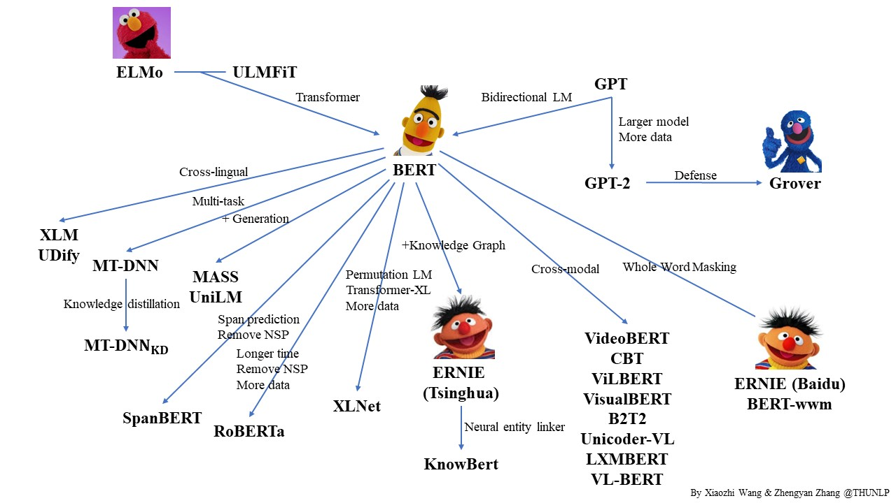

# PLMpapers

Contributed by [Xiaozhi Wang](https://bakser.github.io/) and [Zhengyan Zhang](https://github.com/zzy14).

## Introduction

Pre-trained Languge Model (PLM) is a very popular topic in NLP. In this repo, we list some representative work on PLM and show their relationship with a diagram. Feel free to distribute or use it! [Here](https://github.com/thunlp/PLMpapers/blob/master/PLMfamily.pptx) you can get the source PPT file of the diagram if you want to use it in your presentation.

Corrections and suggestions are welcomed. 

We also released [OpenCLap](https://github.com/thunlp/OpenCLaP), an open-source Chinese language pre-trained model zoo. Welcome to try it.

## Papers
### Models

1. **Semi-supervised Sequence Learning**. *Andrew M. Dai, Quoc V. Le*. NIPS 2015. [[pdf](https://arxiv.org/pdf/1511.01432.pdf)]
2. **context2vec: Learning Generic Context Embedding with Bidirectional LSTM**. *Oren Melamud, Jacob Goldberger, Ido Dagan*. CoNLL 2016. [[pdf](https://www.aclweb.org/anthology/K16-1006.pdf)] [[project](http://u.cs.biu.ac.il/~nlp/resources/downloads/context2vec/)] (**context2vec**)
3. **Unsupervised Pretraining for Sequence to Sequence Learning**. *Prajit Ramachandran, Peter J. Liu, Quoc V. Le*. EMNLP 2017. [[pdf](https://arxiv.org/pdf/1611.02683.pdf)] (**Pre-trained seq2seq**)
4. **Deep contextualized word representations**. *Matthew E. Peters, Mark Neumann, Mohit Iyyer, Matt Gardner, Christopher Clark, Kenton Lee and Luke Zettlemoyer*. NAACL 2018. [[pdf](https://arxiv.org/pdf/1802.05365.pdf)] [[project](https://allennlp.org/elmo)] (**ELMo**)
5. **Universal Language Model Fine-tuning for Text Classification**. *Jeremy Howard and Sebastian Ruder*. ACL 2018. [[pdf](https://www.aclweb.org/anthology/P18-1031)] [[project](http://nlp.fast.ai/category/classification.html)] (**ULMFiT**)
6. **Improving Language Understanding by Generative Pre-Training**. *Alec Radford, Karthik Narasimhan, Tim Salimans and Ilya Sutskever*. Preprint. [[pdf](https://s3-us-west-2.amazonaws.com/openai-assets/research-covers/language-unsupervised/language_understanding_paper.pdf)] [[project](https://openai.com/blog/language-unsupervised/)] (**GPT**)
7. **BERT: Pre-training of Deep Bidirectional Transformers for Language Understanding**. *Jacob Devlin, Ming-Wei Chang, Kenton Lee and Kristina Toutanova*. NAACL 2019. [[pdf](https://arxiv.org/pdf/1810.04805.pdf)] [[code & model](https://github.com/google-research/bert)]
8. **Language Models are Unsupervised Multitask Learners**. *Alec Radford, Jeffrey Wu, Rewon Child, David Luan, Dario Amodei and Ilya Sutskever*. Preprint. [[pdf](https://d4mucfpksywv.cloudfront.net/better-language-models/language_models_are_unsupervised_multitask_learners.pdf)] [[code](https://github.com/openai/gpt-2)] (**GPT-2**)
9. **ERNIE: Enhanced Language Representation with Informative Entities**. *Zhengyan Zhang, Xu Han, Zhiyuan Liu, Xin Jiang, Maosong Sun and Qun Liu*. ACL 2019. [[pdf](https://www.aclweb.org/anthology/P19-1139)] [[code & model](https://github.com/thunlp/ERNIE)] (**ERNIE (Tsinghua)** )
10. **ERNIE: Enhanced Representation through Knowledge Integration**. *Yu Sun, Shuohuan Wang, Yukun Li, Shikun Feng, Xuyi Chen, Han Zhang, Xin Tian, Danxiang Zhu, Hao Tian and Hua Wu*. Preprint. [[pdf](https://arxiv.org/pdf/1904.09223.pdf)] [[code](https://github.com/PaddlePaddle/ERNIE/tree/develop/ERNIE)] (**ERNIE (Baidu)** )
11. **Defending Against Neural Fake News**. *Rowan Zellers, Ari Holtzman, Hannah Rashkin, Yonatan Bisk, Ali Farhadi, Franziska Roesner, Yejin Choi*. NeurIPS 2019. [[pdf](https://arxiv.org/pdf/1905.12616.pdf)] [[project](https://rowanzellers.com/grover/)] (**Grover**)
12. **Cross-lingual Language Model Pretraining**. *Guillaume Lample, Alexis Conneau*. NeurIPS 2019. [[pdf](https://arxiv.org/pdf/1901.07291.pdf)] [[code & model](https://github.com/facebookresearch/XLM)] (**XLM**)
13. **Multi-Task Deep Neural Networks for Natural Language Understanding**. *Xiaodong Liu, Pengcheng He, Weizhu Chen, Jianfeng Gao*. ACL 2019. [[pdf](https://www.aclweb.org/anthology/P19-1441)] [[code & model](https://github.com/namisan/mt-dnn)] (**MT-DNN**)
14. **MASS: Masked Sequence to Sequence Pre-training for Language Generation**. *Kaitao Song, Xu Tan, Tao Qin, Jianfeng Lu, Tie-Yan Liu*. ICML 2019. [[pdf](https://arxiv.org/pdf/1905.02450.pdf)] [[code & model](https://github.com/microsoft/MASS)]
15. **Unified Language Model Pre-training for Natural Language Understanding and Generation**. *Li Dong, Nan Yang, Wenhui Wang, Furu Wei, Xiaodong Liu, Yu Wang, Jianfeng Gao, Ming Zhou, Hsiao-Wuen Hon*. Preprint. [[pdf](https://arxiv.org/pdf/1905.03197.pdf)] (**UniLM**)
16. **XLNet: Generalized Autoregressive Pretraining for Language Understanding**. *Zhilin Yang, Zihang Dai, Yiming Yang, Jaime Carbonell, Ruslan Salakhutdinov, Quoc V. Le*. NeurIPS 2019. [[pdf](https://arxiv.org/pdf/1906.08237.pdf)] [[code & model](https://github.com/zihangdai/xlnet)]
17. **RoBERTa: A Robustly Optimized BERT Pretraining Approach**. *Yinhan Liu, Myle Ott, Naman Goyal, Jingfei Du, Mandar Joshi, Danqi Chen, Omer Levy, Mike Lewis, Luke Zettlemoyer, Veselin Stoyanov*. Preprint. [[pdf](https://arxiv.org/pdf/1907.11692.pdf)] [[code & model](https://github.com/pytorch/fairseq)]
18. **SpanBERT: Improving Pre-training by Representing and Predicting Spans**. *Mandar Joshi, Danqi Chen, Yinhan Liu, Daniel S. Weld, Luke Zettlemoyer, Omer Levy*. Preprint. [[pdf](https://arxiv.org/pdf/1907.10529.pdf)] [[code & model](https://github.com/facebookresearch/SpanBERT)]
19. **Knowledge Enhanced Contextual Word Representations**. *Matthew E. Peters, Mark Neumann, Robert L. Logan IV, Roy Schwartz, Vidur Joshi, Sameer Singh, Noah A. Smith*. EMNLP 2019. [[pdf](https://arxiv.org/pdf/1909.04164.pdf)] (**KnowBert**) 
20. **VisualBERT: A Simple and Performant Baseline for Vision and Language**. *Liunian Harold Li, Mark Yatskar, Da Yin, Cho-Jui Hsieh, Kai-Wei Chang*. Preprint. [[pdf](https://arxiv.org/pdf/1908.03557.pdf)] [[code & model](https://github.com/uclanlp/visualbert)]
21. **ViLBERT: Pretraining Task-Agnostic Visiolinguistic Representations for Vision-and-Language Tasks**. *Jiasen Lu, Dhruv Batra, Devi Parikh, Stefan Lee*. NeurIPS 2019. [[pdf](https://arxiv.org/pdf/1908.02265.pdf)] [[code & model](https://github.com/jiasenlu/vilbert_beta)]
22. **VideoBERT: A Joint Model for Video and Language Representation Learning**. *Chen Sun, Austin Myers, Carl Vondrick, Kevin Murphy, Cordelia Schmid*. ICCV 2019. [[pdf](https://arxiv.org/pdf/1904.01766.pdf)] 
23. **LXMERT: Learning Cross-Modality Encoder Representations from Transformers**. *Hao Tan, Mohit Bansal*. EMNLP 2019. [[pdf](https://arxiv.org/pdf/1908.07490.pdf)] [[code & model](https://github.com/airsplay/lxmert)]
24. **VL-BERT: Pre-training of Generic Visual-Linguistic Representations**. *Weijie Su, Xizhou Zhu, Yue Cao, Bin Li, Lewei Lu, Furu Wei, Jifeng Dai*. Preprint. [[pdf](https://arxiv.org/pdf/1908.08530.pdf)]
25. **Unicoder-VL: A Universal Encoder for Vision and Language by Cross-modal Pre-training**. *Gen Li, Nan Duan, Yuejian Fang, Ming Gong, Daxin Jiang, Ming Zhou*. Preprint. [[pdf](https://arxiv.org/pdf/1908.06066.pdf)]
26. **K-BERT: Enabling Language Representation with Knowledge Graph**. *Weijie Liu, Peng Zhou, Zhe Zhao, Zhiruo Wang, Qi Ju, Haotang Deng, Ping Wang*. Preprint. [[pdf](https://arxiv.org/pdf/1909.07606.pdf)]
27. **Fusion of Detected Objects in Text for Visual Question Answering**. *Chris Alberti, Jeffrey Ling, Michael Collins, David Reitter*. EMNLP 2019. [[pdf](https://arxiv.org/pdf/1908.05054.pdf)] (**B2T2**)
28. **Contrastive Bidirectional Transformer for Temporal Representation Learning**. *Chen Sun, Fabien Baradel, Kevin Murphy, Cordelia Schmid*. Preprint. [[pdf](https://arxiv.org/pdf/1906.05743.pdf)] (**CBT**)
29. **ERNIE 2.0: A Continual Pre-training Framework for Language Understanding**. *Yu Sun, Shuohuan Wang, Yukun Li, Shikun Feng, Hao Tian, Hua Wu, Haifeng Wang*. Preprint. [[pdf](https://arxiv.org/pdf/1907.12412v1.pdf)] [[code](https://github.com/PaddlePaddle/ERNIE/blob/develop/README.md)] 
30. **75 Languages, 1 Model: Parsing Universal Dependencies Universally**. *Dan Kondratyuk, Milan Straka*. EMNLP 2019. [[pdf](https://arxiv.org/pdf/1904.02099.pdf)] [[code & model](https://github.com/hyperparticle/udify)] (**UDify**)
31. **Pre-Training with Whole Word Masking for Chinese BERT**. *Yiming Cui, Wanxiang Che, Ting Liu, Bing Qin, Ziqing Yang, Shijin Wang, Guoping Hu*. Preprint. [[pdf](https://arxiv.org/pdf/1906.08101.pdf)] [[code & model](https://github.com/ymcui/Chinese-BERT-wwm/blob/master/README_EN.md)] (**Chinese-BERT-wwm**)
32. **UNITER: Learning UNiversal Image-TExt Representations**. *Yen-Chun Chen, Linjie Li, Licheng Yu, Ahmed El Kholy, Faisal Ahmed, Zhe Gan, Yu Cheng, Jingjing Liu*. Preprint. [[pdf](https://arxiv.org/pdf/1909.11740.pdf)]
34. **MultiFiT: Efficient Multi-lingual Language Model Fine-tuning**.  *Julian Eisenschlos, Sebastian Ruder, Piotr Czapla, Marcin Kardas, Sylvain Gugger, Jeremy Howard*. EMNLP 2019. [[pdf](https://arxiv.org/pdf/1909.04761.pdf)] [[code & model](http://nlp.fast.ai/classification/2019/09/10/multifit.html)]
35. **Exploring the Limits of Transfer Learning with a Unified Text-to-Text Transformer**.  *Colin Raffel, Noam Shazeer, Adam Roberts, Katherine Lee, Sharan Narang, Michael Matena, Yanqi Zhou, Wei Li, Peter J. Liu*. Preprint. [[pdf](https://arxiv.org/pdf/1910.10683.pdf)] [[code & model](https://github.com/google-research/text-to-text-transfer-transformer)] (**T5**)
36. **BART: Denoising Sequence-to-Sequence Pre-training for Natural Language Generation, Translation, and Comprehension**. *Mike Lewis, Yinhan Liu, Naman Goyal, Marjan Ghazvininejad, Abdelrahman Mohamed, Omer Levy, Ves Stoyanov, Luke Zettlemoyer*. ACL 2020. [[pdf](https://arxiv.org/pdf/1910.13461.pdf)]
37. **ELECTRA: Pre-training Text Encoders as Discriminators Rather Than Generators**. *Kevin Clark, Minh-Thang Luong, Quoc V. Le, Christopher D. Manning*. ICLR 2020. [[pdf](https://openreview.net/pdf?id=r1xMH1BtvB)]
38. **A Mutual Information Maximization Perspective of Language Representation Learning**. *Lingpeng Kong, Cyprien de Masson d'Autume, Lei Yu, Wang Ling, Zihang Dai, Dani Yogatama*. ICLR 2020. [[pdf](https://openreview.net/pdf?id=Syx79eBKwr)]
39. **StructBERT: Incorporating Language Structures into Pre-training for Deep Language Understanding**. *Wei Wang, Bin Bi, Ming Yan, Chen Wu, Jiangnan Xia, Zuyi Bao, Liwei Peng, Luo Si*. ICLR 2020. [[pdf](https://openreview.net/pdf?id=BJgQ4lSFPH)]
41. **Poly-encoders: Architectures and Pre-training Strategies for Fast and Accurate Multi-sentence Scorings**. *Samuel Humeau, Kurt Shuster, Marie-Anne Lachaux, Jason Weston*. ICLR 2020. [[pdf](https://openreview.net/pdf?id=SkxgnnNFvH)]
43. **FreeLB: Enhanced Adversarial Training for Language Understanding**. *Chen Zhu, Yu Cheng, Zhe Gan, Siqi Sun, Thomas Goldstein, Jingjing Liu*. ICLR 2020. [[pdf](https://openreview.net/pdf?id=BygzbyHFvB)]
44. **Multilingual Alignment of Contextual Word Representations**. *Steven Cao, Nikita Kitaev, Dan Klein*. ICLR 2020. [[pdf](https://openreview.net/pdf?id=r1xCMyBtPS)]
45. **TaBERT: Pretraining for Joint Understanding of Textual and Tabular Data**. *Pengcheng Yin, Graham Neubig, Wen-tau Yih, Sebastian Riedel*. ACL 2020. [[pdf](https://www.aclweb.org/anthology/2020.acl-main.745.pdf)] [[code](https://github.com/facebookresearch/TaBERT)]
46. **BERTRAM: Improved Word Embeddings Have Big Impact on Contextualized Model Performance**. *Timo Schick, Hinrich Schutze*. ACL 2020. [[pdf](https://www.aclweb.org/anthology/2020.acl-main.368.pdf)]
47. **TAPAS: Weakly Supervised Table Parsing via Pre-training**. *Jonathan Herzig, Paweł Krzysztof Nowak, Thomas Müller, Francesco Piccinno, Julian Martin Eisenschlos*. ACL 2020. [[pdf](https://www.aclweb.org/anthology/2020.acl-main.398.pdf)]

### Knowledge Distillation & Model Compression

1. **TinyBERT: Distilling BERT for Natural Language Understanding**. *Xiaoqi Jiao, Yichun Yin, Lifeng Shang, Xin Jiang, Xiao Chen, Linlin Li, Fang Wang, Qun Liu*. Preprint. [[pdf](https://arxiv.org/pdf/1909.10351v2.pdf)] [[code & model](https://github.com/huawei-noah/Pretrained-Language-Model/tree/master/TinyBERT)]
2. **Distilling Task-Specific Knowledge from BERT into Simple Neural Networks**. *Raphael Tang, Yao Lu, Linqing Liu, Lili Mou, Olga Vechtomova, Jimmy Lin*. Preprint. [[pdf](https://arxiv.org/pdf/1903.12136.pdf)]
3. **Patient Knowledge Distillation for BERT Model Compression**. *Siqi Sun, Yu Cheng, Zhe Gan, Jingjing Liu*. EMNLP 2019. [[pdf](https://arxiv.org/pdf/1908.09355.pdf)] [[code](https://github.com/intersun/PKD-for-BERT-Model-Compression)]
4. **Model Compression with Multi-Task Knowledge Distillation for Web-scale Question Answering System**. *Ze Yang, Linjun Shou, Ming Gong, Wutao Lin, Daxin Jiang*. Preprint. [[pdf](https://arxiv.org/pdf/1904.09636.pdf)]
5. **PANLP at MEDIQA 2019: Pre-trained Language Models, Transfer Learning and Knowledge Distillation**. *Wei Zhu, Xiaofeng Zhou, Keqiang Wang, Xun Luo, Xiepeng Li, Yuan Ni, Guotong Xie*. The 18th BioNLP workshop. [[pdf](https://www.aclweb.org/anthology/W19-5040)]
6. **Improving Multi-Task Deep Neural Networks via Knowledge Distillation for Natural Language Understanding**. *Xiaodong Liu, Pengcheng He, Weizhu Chen, Jianfeng Gao*. Preprint. [[pdf](https://arxiv.org/pdf/1904.09482.pdf)] [[code & model](https://github.com/namisan/mt-dnn)]
7. **Well-Read Students Learn Better: The Impact of Student Initialization on Knowledge Distillation**. *Iulia Turc, Ming-Wei Chang, Kenton Lee, Kristina Toutanova*. Preprint. [[pdf](https://arxiv.org/pdf/1908.08962.pdf)]
8. **Small and Practical BERT Models for Sequence Labeling**. *Henry Tsai, Jason Riesa, Melvin Johnson, Naveen Arivazhagan, Xin Li, Amelia Archer*. EMNLP 2019. [[pdf](https://arxiv.org/pdf/1909.00100.pdf)]
9. **Q-BERT: Hessian Based Ultra Low Precision Quantization of BERT**. *Sheng Shen, Zhen Dong, Jiayu Ye, Linjian Ma, Zhewei Yao, Amir Gholami, Michael W. Mahoney, Kurt Keutzer*. Preprint. [[pdf](https://arxiv.org/pdf/1909.05840.pdf)]
10. **ALBERT: A Lite BERT for Self-supervised Learning of Language Representations**.  *Zhenzhong Lan, Mingda Chen, Sebastian Goodman, Kevin Gimpel, Piyush Sharma, Radu Soricut*. ICLR 2020. [[pdf](https://openreview.net/pdf?id=H1eA7AEtvS)]
11. **Extreme Language Model Compression with Optimal Subwords and Shared Projections**. *Sanqiang Zhao, Raghav Gupta, Yang Song, Denny Zhou*. Preprint. [[pdf](https://arxiv.org/pdf/1909.11687)]
12. **DistilBERT, a distilled version of BERT: smaller, faster, cheaper and lighter**. *Victor Sanh, Lysandre Debut, Julien Chaumond, Thomas Wolf*. Preprint. [[pdf](https://arxiv.org/pdf/1910.01108)]
13. **Reducing Transformer Depth on Demand with Structured Dropout**.  *Angela Fan, Edouard Grave, Armand Joulin*. ICLR 2020. [[pdf](https://openreview.net/pdf?id=SylO2yStDr)]
14. **Thieves on Sesame Street! Model Extraction of BERT-based APIs**. *Kalpesh Krishna, Gaurav Singh Tomar, Ankur P. Parikh, Nicolas Papernot, Mohit Iyyer*. ICLR 2020. [[pdf](https://openreview.net/pdf?id=Byl5NREFDr)]
15. **DeeBERT: Dynamic Early Exiting for Accelerating BERT Inference**. *Ji Xin, Raphael Tang, Jaejun Lee, Yaoliang Yu, Jimmy Lin*. ACL 2020. [[pdf](https://www.aclweb.org/anthology/2020.acl-main.204.pdf)]

### Analysis

1. **Revealing the Dark Secrets of BERT**. *Olga Kovaleva, Alexey Romanov, Anna Rogers, Anna Rumshisky*. EMNLP 2019. [[pdf](https://arxiv.org/abs/1908.08593)] 
2. **How Does BERT Answer Questions? A Layer-Wise Analysis of Transformer Representations**. *Betty van Aken, Benjamin Winter, Alexander Löser, Felix A. Gers*. CIKM 2019. [[pdf](https://arxiv.org/pdf/1909.04925.pdf)]
3. **Are Sixteen Heads Really Better than One?**. *Paul Michel, Omer Levy, Graham Neubig*. Preprint. [[pdf](https://arxiv.org/pdf/1905.10650.pdf)] [[code](https://github.com/pmichel31415/are-16-heads-really-better-than-1)]
4. **Is BERT Really Robust? A Strong Baseline for Natural Language Attack on Text Classification and Entailment**. *Di Jin, Zhijing Jin, Joey Tianyi Zhou, Peter Szolovits*. Preprint. [[pdf](https://arxiv.org/pdf/1907.11932.pdf)] [[code](https://github.com/jind11/TextFooler)]
5. **BERT has a Mouth, and It Must Speak: BERT as a Markov Random Field Language Model**. *Alex Wang, Kyunghyun Cho*. NeuralGen 2019. [[pdf](https://arxiv.org/pdf/1902.04094.pdf)] [[code](https://github.com/nyu-dl/bert-gen)]
6. **Linguistic Knowledge and Transferability of Contextual Representations**. *Nelson F. Liu, Matt Gardner, Yonatan Belinkov, Matthew E. Peters, Noah A. Smith*. NAACL 2019. [[pdf](https://www.aclweb.org/anthology/N19-1112)]
7. **What Does BERT Look At? An Analysis of BERT's Attention**. *Kevin Clark, Urvashi Khandelwal, Omer Levy, Christopher D. Manning*. BlackBoxNLP 2019. [[pdf](https://arxiv.org/pdf/1906.04341.pdf)] [[code](https://github.com/clarkkev/attention-analysis)]
8. **Open Sesame: Getting Inside BERT's Linguistic Knowledge**. *Yongjie Lin, Yi Chern Tan, Robert Frank*. BlackBoxNLP 2019. [[pdf](https://arxiv.org/pdf/1906.01698.pdf)] [[code](https://github.com/yongjie-lin/bert-opensesame)]
9. **Analyzing the Structure of Attention in a Transformer Language Model**. *Jesse Vig, Yonatan Belinkov*. BlackBoxNLP 2019. [[pdf](https://arxiv.org/pdf/1906.04284.pdf)]
10. **Blackbox meets blackbox: Representational Similarity and Stability Analysis of Neural Language Models and Brains**. *Samira Abnar, Lisa Beinborn, Rochelle Choenni, Willem Zuidema*. BlackBoxNLP 2019. [[pdf](https://arxiv.org/pdf/1906.01539.pdf)]
11. **BERT Rediscovers the Classical NLP Pipeline**. *Ian Tenney, Dipanjan Das, Ellie Pavlick*. ACL 2019. [[pdf](https://www.aclweb.org/anthology/P19-1452)]
12. **How multilingual is Multilingual BERT?**. *Telmo Pires, Eva Schlinger, Dan Garrette*. ACL 2019. [[pdf](https://www.aclweb.org/anthology/P19-1493)]
13. **What Does BERT Learn about the Structure of Language?**. *Ganesh Jawahar, Benoît Sagot, Djamé Seddah*. ACL 2019. [[pdf](https://www.aclweb.org/anthology/P19-1356)]
14. **Beto, Bentz, Becas: The Surprising Cross-Lingual Effectiveness of BERT**. *Shijie Wu, Mark Dredze*. EMNLP 2019. [[pdf](https://arxiv.org/pdf/1904.09077.pdf)]
15. **How Contextual are Contextualized Word Representations? Comparing the Geometry of BERT, ELMo, and GPT-2 Embeddings**. *Kawin Ethayarajh*. EMNLP 2019. [[pdf](https://arxiv.org/pdf/1909.00512.pdf)]
16. **Probing Neural Network Comprehension of Natural Language Arguments**. *Timothy Niven, Hung-Yu Kao*. ACL 2019. [[pdf](https://www.aclweb.org/anthology/P19-1459)] [[code](https://github.com/IKMLab/arct2)]
17. **Universal Adversarial Triggers for Attacking and Analyzing NLP**. *Eric Wallace, Shi Feng, Nikhil Kandpal, Matt Gardner, Sameer Singh*. EMNLP 2019. [[pdf](https://arxiv.org/pdf/1908.07125.pdf)] [[code](https://github.com/Eric-Wallace/universal-triggers)]
18. **The Bottom-up Evolution of Representations in the Transformer: A Study with Machine Translation and Language Modeling Objectives**. *Elena Voita, Rico Sennrich, Ivan Titov*. EMNLP 2019. [[pdf](https://arxiv.org/pdf/1909.01380.pdf)]
19. **Do NLP Models Know Numbers? Probing Numeracy in Embeddings**. *Eric Wallace, Yizhong Wang, Sujian Li, Sameer Singh, Matt Gardner*. EMNLP 2019. [[pdf](https://arxiv.org/pdf/1909.07940.pdf)]
20. **Investigating BERT's Knowledge of Language: Five Analysis Methods with NPIs**. *Alex Warstadt, Yu Cao, Ioana Grosu, Wei Peng, Hagen Blix, Yining Nie, Anna Alsop, Shikha Bordia, Haokun Liu, Alicia Parrish, Sheng-Fu Wang, Jason Phang, Anhad Mohananey, Phu Mon Htut, Paloma Jeretič, Samuel R. Bowman*. EMNLP 2019. [[pdf](https://arxiv.org/pdf/1909.02597.pdf)] [[code](https://github.com/alexwarstadt/data_generation)]
21. **Visualizing and Understanding the Effectiveness of BERT**. *Yaru Hao, Li Dong, Furu Wei, Ke Xu*. EMNLP 2019. [[pdf](https://arxiv.org/pdf/1908.05620.pdf)]
22. **Visualizing and Measuring the Geometry of BERT**. *Andy Coenen, Emily Reif, Ann Yuan, Been Kim, Adam Pearce, Fernanda Viégas, Martin Wattenberg*. NeurIPS 2019. [[pdf](https://arxiv.org/pdf/1906.02715.pdf)]
23. **On the Validity of Self-Attention as Explanation in Transformer Models**. *Gino Brunner, Yang Liu, Damián Pascual, Oliver Richter, Roger Wattenhofer*. Preprint. [[pdf](https://arxiv.org/pdf/1908.04211.pdf)]
24. **Transformer Dissection: An Unified Understanding for Transformer's Attention via the Lens of Kernel**. *Yao-Hung Hubert Tsai, Shaojie Bai, Makoto Yamada, Louis-Philippe Morency, Ruslan Salakhutdinov*. EMNLP 2019. [[pdf](https://arxiv.org/pdf/1908.11775.pdf)]
25. **Language Models as Knowledge Bases?** *Fabio Petroni, Tim Rocktäschel, Patrick Lewis, Anton Bakhtin, Yuxiang Wu, Alexander H. Miller, Sebastian Riedel*. EMNLP 2019, [[pdf](https://arxiv.org/pdf/1909.01066.pdf)] [[code](https://github.com/facebookresearch/LAMA)]
26. **To Tune or Not to Tune? Adapting Pretrained Representations to Diverse Tasks**. *Matthew E. Peters, Sebastian Ruder, Noah A. Smith*. RepL4NLP 2019, [[pdf](https://www.aclweb.org/anthology/W19-4302.pdf)]
27. **On the Cross-lingual Transferability of Monolingual Representations**. *Mikel Artetxe, Sebastian Ruder, Dani Yogatama*. Preprint, [[pdf](https://arxiv.org/pdf/1910.11856.pdf)] [[dataset](https://github.com/deepmind/XQuAD)]
28. **A Structural Probe for Finding Syntax in Word Representations**. *John Hewitt, Christopher D. Manning*. NAACL 2019. [[pdf](https://www.aclweb.org/anthology/N19-1419.pdf)]
29. **Assessing BERT’s Syntactic Abilities**. *Yoav Goldberg*. Technical Report. [[pdf](https://arxiv.org/pdf/1901.05287.pdf)]
30. **What do you learn from context? Probing for sentence structure in contextualized word representations**. *Ian Tenney, Patrick Xia, Berlin Chen, Alex Wang, Adam Poliak, R. Thomas McCoy, Najoung Kim, Benjamin Van Durme, Samuel R. Bowman,
Dipanjan Das, and Ellie Pavlick*. ICLR 2019. [[pdf](https://arxiv.org/pdf/1905.06316.pdf)]
31. **Can You Tell Me How to Get Past Sesame Street? Sentence-Level Pretraining Beyond Language Modeling**. *Alex Wang, Jan Hula, Patrick Xia, Raghavendra Pappagari, R. Thomas McCoy, Roma Patel, Najoung Kim, Ian Tenney, Yinghui Huang, Katherin Yu, Shuning Jin, Berlin Chen, Benjamin Van Durme, Edouard Grave, Ellie Pavlick, Samuel R. Bowman*. ACL 2019. [[pdf](https://arxiv.org/pdf/1812.10860.pdf)]
31. **BERT is Not an Interlingua and the Bias of Tokenization**. *Jasdeep Singh, Bryan McCann, Richard Socher, and Caiming Xiong*. DeepLo 2019. [[pdf](https://www.aclweb.org/anthology/D19-6106.pdf)] [[dataset](https://github.com/salesforce/xnli_extension)]
32. **What BERT is not: Lessons from a new suite of psycholinguistic diagnostics for language models**. *Allyson Ettinger*. Preprint. [[pdf](https://arxiv.org/pdf/1907.13528)] [[code](https://github.com/aetting/lm-diagnostics)]
33. **How Language-Neutral is Multilingual BERT?**. *Jindřich Libovický, Rudolf Rosa, and Alexander Fraser*. Preprint. [[pdf](https://arxiv.org/pdf/1911.03310)]
34. **Cross-Lingual Ability of Multilingual BERT: An Empirical Study**. *Karthikeyan K, Zihan Wang, Stephen Mayhew, Dan Roth*. ICLR 2020. [[pdf](https://openreview.net/pdf?id=HJeT3yrtDr)]
35. **Finding Universal Grammatical Relations in Multilingual BERT**. *Ethan A. Chi, John Hewitt, Christopher D. Manning*. ACL 2020. [[pdf](https://www.aclweb.org/anthology/2020.acl-main.493.pdf)]
36. **Negated and Misprimed Probes for Pretrained Language Models: Birds Can Talk, But Cannot Fly**. *Nora Kassner, Hinrich Schütze*. ACL 2020. [[pdf](https://www.aclweb.org/anthology/2020.acl-main.698.pdf)]
36. **Perturbed Masking: Parameter-free Probing for Analyzing and Interpreting BERT**. *Zhiyong Wu, Yun Chen, Ben Kao, Qun Liu*. ACL 2020. [[pdf](https://www.aclweb.org/anthology/2020.acl-main.383.pdf)]

## Finetuning/Adaptation

1. **SMART: Robust and Efficient Fine-Tuning for Pre-trained Natural Language Models through Principled Regularized Optimization**. *Haoming Jiang, Pengcheng He, Weizhu Chen, Xiaodong Liu, Jianfeng Gao, Tuo Zhao*. ACL 2020. [[pdf](https://www.aclweb.org/anthology/2020.acl-main.197.pdf)]
2. **Do you have the right scissors? Tailoring Pre-trained Language Models via Monte-Carlo Methods**. *Ning Miao, Yuxuan Song, Hao Zhou, Lei Li*. ACL 2020. [[pdf](https://www.aclweb.org/anthology/2020.acl-main.314.pdf)]
3. **ExpBERT: Representation Engineering with Natural Language Explanations**. *Shikhar Murty, Pang Wei Koh, Percy Liang*. ACL 2020. [[pdf](https://www.aclweb.org/anthology/2020.acl-main.190.pdf)]
4. **Don’t Stop Pretraining: Adapt Language Models to Domains and Tasks**. *Suchin Gururangan, Ana Marasović, Swabha Swayamdipta, Kyle Lo, Iz Beltagy, Doug Downey, Noah A. Smith*. ACL 2020. [[pdf](https://www.aclweb.org/anthology/2020.acl-main.740.pdf)]

## Tutorial & Resource

1. **Transfer Learning in Natural Language Processing**. *Sebastian Ruder, Matthew E. Peters, Swabha Swayamdipta, Thomas Wolf*. NAACL 2019. [[slides](https://docs.google.com/presentation/d/1fIhGikFPnb7G5kr58OvYC3GN4io7MznnM0aAgadvJfc/edit?usp=sharing)] 
2. **Transformers: State-of-the-art Natural Language Processing**. *Thomas Wolf, Lysandre Debut, Victor Sanh, Julien Chaumond, Clement Delangue, Anthony Moi, Pierric Cistac, Tim Rault, Rémi Louf, Morgan Funtowicz, Jamie Brew*. Preprint. [[pdf](https://arxiv.org/pdf/1910.03771.pdf)] [[code](https://github.com/huggingface/transformers)]
