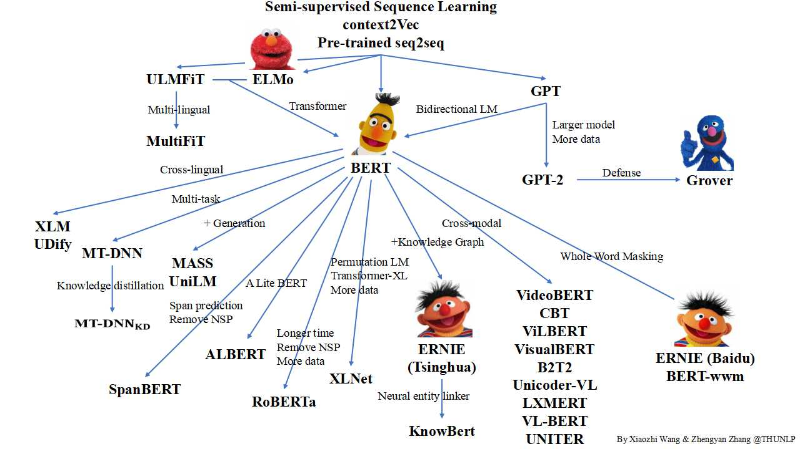

# PLMpapers

Contributed by [Xiaozhi Wang](https://bakser.github.io/) and [Zhengyan Zhang](https://github.com/zzy14).

## Introduction

Pre-trained Languge Model (PLM) is a very popular topic in NLP. In this repo, we list some representative work on PLM and show their relationship with a family tree: 

Corrections and suggestions are welcomed.

## Papers
### Models

1. **Deep contextualized word representations**. *Matthew E. Peters, Mark Neumann, Mohit Iyyer, Matt Gardner, Christopher Clark, Kenton Lee and Luke Zettlemoyer*. NAACL 2018. [[pdf](https://arxiv.org/pdf/1802.05365.pdf)] [[project](https://allennlp.org/elmo)] (**ELMo**)
2. **Universal Language Model Fine-tuning for Text Classification**. *Jeremy Howard and Sebastian Ruder*. ACL 2018. [[pdf](https://www.aclweb.org/anthology/P18-1031)] [[project](http://nlp.fast.ai/category/classification.html)] (**ULMFiT**)
3. **Improving Language Understanding by Generative Pre-Training**. *Alec Radford, Karthik Narasimhan, Tim Salimans and Ilya Sutskever*. Preprint. [[pdf](https://s3-us-west-2.amazonaws.com/openai-assets/research-covers/language-unsupervised/language_understanding_paper.pdf)] [[project](https://openai.com/blog/language-unsupervised/)] (**GPT**)
4. **BERT: Pre-training of Deep Bidirectional Transformers for Language Understanding**. *Jacob Devlin, Ming-Wei Chang, Kenton Lee and Kristina Toutanova*. NAACL 2019. [[pdf](https://arxiv.org/pdf/1810.04805.pdf)] [[code & model](https://github.com/google-research/bert)]
5. **Language Models are Unsupervised Multitask Learners**. *Alec Radford, Jeffrey Wu, Rewon Child, David Luan, Dario Amodei and Ilya Sutskever*. Preprint. [[pdf](https://d4mucfpksywv.cloudfront.net/better-language-models/language_models_are_unsupervised_multitask_learners.pdf)] [[code](https://github.com/openai/gpt-2)] (**GPT-2**)
6. **ERNIE: Enhanced Language Representation with Informative Entities**. *Zhengyan Zhang, Xu Han, Zhiyuan Liu, Xin Jiang, Maosong Sun and Qun Liu*. ACL2019. [[pdf](https://www.aclweb.org/anthology/P19-1139)] [[code & model](https://github.com/thunlp/ERNIE)] (**ERNIE (Tsinghua)** )
7. **ERNIE: Enhanced Representation through Knowledge Integration**. *Yu Sun, Shuohuan Wang, Yukun Li, Shikun Feng, Xuyi Chen, Han Zhang, Xin Tian, Danxiang Zhu, Hao Tian and Hua Wu*. Preprint. [[pdf](https://arxiv.org/pdf/1904.09223.pdf)] [[code](https://github.com/PaddlePaddle/ERNIE/tree/develop/ERNIE)] (**ERNIE (Baidu)** )
8. **Defending Against Neural Fake News**. *Rowan Zellers, Ari Holtzman, Hannah Rashkin, Yonatan Bisk, Ali Farhadi, Franziska Roesner, Yejin Choi*. NeurIPS. [[pdf](https://arxiv.org/pdf/1905.12616.pdf)] [[project](https://rowanzellers.com/grover/)] (**Grover**)
9. **Cross-lingual Language Model Pretraining**. *Guillaume Lample, Alexis Conneau*. NeurIPS2019. [[pdf](https://arxiv.org/pdf/1901.07291.pdf)] [[code & model](https://github.com/facebookresearch/XLM)] (**XLM**)
10. **Multi-Task Deep Neural Networks for Natural Language Understanding**. *Xiaodong Liu, Pengcheng He, Weizhu Chen, Jianfeng Gao*. ACL2019. [[pdf](https://www.aclweb.org/anthology/P19-1441)] [[code & model](https://github.com/namisan/mt-dnn)] (**MT-DNN**)
11. **MASS: Masked Sequence to Sequence Pre-training for Language Generation**. *Kaitao Song, Xu Tan, Tao Qin, Jianfeng Lu, Tie-Yan Liu*. ICML2019. [[pdf](https://arxiv.org/pdf/1905.02450.pdf)] [[code & model](https://github.com/microsoft/MASS)]
12. **Unified Language Model Pre-training for Natural Language Understanding and Generation**. *Li Dong, Nan Yang, Wenhui Wang, Furu Wei, Xiaodong Liu, Yu Wang, Jianfeng Gao, Ming Zhou, Hsiao-Wuen Hon*. Preprint. [[pdf](https://arxiv.org/pdf/1905.03197.pdf)] (**UniLM**)
13. **XLNet: Generalized Autoregressive Pretraining for Language Understanding**. *Zhilin Yang, Zihang Dai, Yiming Yang, Jaime Carbonell, Ruslan Salakhutdinov, Quoc V. Le*. NeurIPS2019. [[pdf](https://arxiv.org/pdf/1906.08237.pdf)] [[code & model](https://github.com/zihangdai/xlnet)]
14. **RoBERTa: A Robustly Optimized BERT Pretraining Approach**. *Yinhan Liu, Myle Ott, Naman Goyal, Jingfei Du, Mandar Joshi, Danqi Chen, Omer Levy, Mike Lewis, Luke Zettlemoyer, Veselin Stoyanov*. Preprint. [[pdf](https://arxiv.org/pdf/1907.11692.pdf)] [[code & model](https://github.com/pytorch/fairseq)]
15. **SpanBERT: Improving Pre-training by Representing and Predicting Spans**. *Mandar Joshi, Danqi Chen, Yinhan Liu, Daniel S. Weld, Luke Zettlemoyer, Omer Levy*. Preprint. [[pdf](https://arxiv.org/pdf/1907.10529.pdf)] [[code & model](https://github.com/facebookresearch/SpanBERT)]
16. **Knowledge Enhanced Contextual Word Representations**. *Matthew E. Peters, Mark Neumann, Robert L. Logan IV, Roy Schwartz, Vidur Joshi, Sameer Singh, Noah A. Smith*. EMNLP2019. [[pdf](https://arxiv.org/pdf/1909.04164.pdf)] (**KnowBert**) 
17. **VisualBERT: A Simple and Performant Baseline for Vision and Language**. *Liunian Harold Li, Mark Yatskar, Da Yin, Cho-Jui Hsieh, Kai-Wei Chang*. Preprint. [[pdf](https://arxiv.org/pdf/1908.03557.pdf)] [[code & model](https://github.com/uclanlp/visualbert)]
18. **ViLBERT: Pretraining Task-Agnostic Visiolinguistic Representations for Vision-and-Language Tasks**. *Jiasen Lu, Dhruv Batra, Devi Parikh, Stefan Lee*. NeurIPS. [[pdf](https://arxiv.org/pdf/1908.02265.pdf)] [[code & model](https://github.com/jiasenlu/vilbert_beta)]
19. **VideoBERT: A Joint Model for Video and Language Representation Learning**. *Chen Sun, Austin Myers, Carl Vondrick, Kevin Murphy, Cordelia Schmid*. ICCV2019. [[pdf](https://arxiv.org/pdf/1904.01766.pdf)] 
20. **LXMERT: Learning Cross-Modality Encoder Representations from Transformers**. *Hao Tan, Mohit Bansal*. EMNLP2019. [[pdf](https://arxiv.org/pdf/1908.07490.pdf)] [[code & model](https://github.com/airsplay/lxmert)]
21. **VL-BERT: Pre-training of Generic Visual-Linguistic Representations**. *Weijie Su, Xizhou Zhu, Yue Cao, Bin Li, Lewei Lu, Furu Wei, Jifeng Dai*. Preprint. [[pdf](https://arxiv.org/pdf/1908.08530.pdf)]
22. **Unicoder-VL: A Universal Encoder for Vision and Language by Cross-modal Pre-training**. *Gen Li, Nan Duan, Yuejian Fang, Ming Gong, Daxin Jiang, Ming Zhou*. Preprint. [[pdf](https://arxiv.org/pdf/1908.06066.pdf)]
23. **K-BERT: Enabling Language Representation with Knowledge Graph**. *Weijie Liu, Peng Zhou, Zhe Zhao, Zhiruo Wang, Qi Ju, Haotang Deng, Ping Wang*. Preprint. [[pdf](https://arxiv.org/pdf/1909.07606.pdf)]
24. **Fusion of Detected Objects in Text for Visual Question Answering**. *Chris Alberti, Jeffrey Ling, Michael Collins, David Reitter*. EMNLP2019. [[pdf](https://arxiv.org/pdf/1908.05054.pdf)] (**B2T2**)
25. **Contrastive Bidirectional Transformer for Temporal Representation Learning**. *Chen Sun, Fabien Baradel, Kevin Murphy, Cordelia Schmid*. Preprint. [[pdf](https://arxiv.org/pdf/1906.05743.pdf)] (**CBT**)
26. **ERNIE 2.0: A Continual Pre-training Framework for Language Understanding**. *Yu Sun, Shuohuan Wang, Yukun Li, Shikun Feng, Hao Tian, Hua Wu, Haifeng Wang*. Preprint. [[pdf](https://arxiv.org/pdf/1907.12412v1.pdf)] [[code](https://github.com/PaddlePaddle/ERNIE/blob/develop/README.md)] 
27. **75 Languages, 1 Model: Parsing Universal Dependencies Universally**. *Dan Kondratyuk, Milan Straka*. EMNLP2019. [[pdf](https://arxiv.org/pdf/1904.02099.pdf)] [[code & model](https://github.com/hyperparticle/udify)] (**UDify**)
28. **Pre-Training with Whole Word Masking for Chinese BERT**. *Yiming Cui, Wanxiang Che, Ting Liu, Bing Qin, Ziqing Yang, Shijin Wang, Guoping Hu*. Preprint. [[pdf](https://arxiv.org/pdf/1906.08101.pdf)] [[code & model](https://github.com/ymcui/Chinese-BERT-wwm/blob/master/README_EN.md)] (**Chinese-BERT-wwm**)

### Knowledge Distillation & Model Compression

1. **TinyBERT: Distilling BERT for Natural Language Understanding**. *Xiaoqi Jiao, Yichun Yin, Lifeng Shang, Xin Jiang, Xiao Chen, Linlin Li, Fang Wang, Qun Liu*. [[pdf](https://arxiv.org/pdf/1909.10351v1.pdf)]
2. **Distilling Task-Specific Knowledge from BERT into Simple Neural Networks**. *Raphael Tang, Yao Lu, Linqing Liu, Lili Mou, Olga Vechtomova, Jimmy Lin*. Preprint. [[pdf](https://arxiv.org/pdf/1903.12136.pdf)]
3. **Patient Knowledge Distillation for BERT Model Compression**. *Siqi Sun, Yu Cheng, Zhe Gan, Jingjing Liu*. EMNLP2019. [[pdf](https://arxiv.org/pdf/1908.09355.pdf)] [[code](https://github.com/intersun/PKD-for-BERT-Model-Compression)]
4. **Model Compression with Multi-Task Knowledge Distillation for Web-scale Question Answering System**. *Ze Yang, Linjun Shou, Ming Gong, Wutao Lin, Daxin Jiang*. Preprint. [[pdf](https://arxiv.org/pdf/1904.09636.pdf)]
5. **PANLP at MEDIQA 2019: Pre-trained Language Models, Transfer Learning and Knowledge Distillation**. *Wei Zhu, Xiaofeng Zhou, Keqiang Wang, Xun Luo, Xiepeng Li, Yuan Ni, Guotong Xie*. The 18th BioNLP workshop. [[pdf](https://www.aclweb.org/anthology/W19-5040)]
6. **Improving Multi-Task Deep Neural Networks via Knowledge Distillation for Natural Language Understanding**. *Xiaodong Liu, Pengcheng He, Weizhu Chen, Jianfeng Gao*. Preprint. [[pdf](https://arxiv.org/pdf/1904.09482.pdf)] [[code & model](https://github.com/namisan/mt-dnn)]
7. **Well-Read Students Learn Better: The Impact of Student Initialization on Knowledge Distillation**. *Iulia Turc, Ming-Wei Chang, Kenton Lee, Kristina Toutanova*. Preprint. [[pdf](https://arxiv.org/pdf/1908.08962.pdf)]
8. **Small and Practical BERT Models for Sequence Labeling**. *Henry Tsai, Jason Riesa, Melvin Johnson, Naveen Arivazhagan, Xin Li, Amelia Archer*. EMNLP2019. [[pdf](https://arxiv.org/pdf/1909.00100.pdf)]
9. **Q-BERT: Hessian Based Ultra Low Precision Quantization of BERT**. *Sheng Shen, Zhen Dong, Jiayu Ye, Linjian Ma, Zhewei Yao, Amir Gholami, Michael W. Mahoney, Kurt Keutzer*. Preprint. [[pdf](https://arxiv.org/pdf/1909.05840.pdf)]
10. **ALBERT: A Lite BERT for Self-supervised Learning of Language Representations**.  *Anonymous authors*. ICLR2020 under review. [[pdf](https://openreview.net/pdf?id=H1eA7AEtvS)]

### Analysis

1. **Revealing the Dark Secrets of BERT**. *Olga Kovaleva, Alexey Romanov, Anna Rogers, Anna Rumshisky*. EMNLP2019. [[pdf](https://arxiv.org/abs/1908.08593)] 
2. **How Does BERT Answer Questions? A Layer-Wise Analysis of Transformer Representations**. *Betty van Aken, Benjamin Winter, Alexander Löser, Felix A. Gers*. CIKM2019. [[pdf](https://arxiv.org/pdf/1909.04925.pdf)]
3. **Are Sixteen Heads Really Better than One?**. *Paul Michel, Omer Levy, Graham Neubig*. Preprint. [[pdf](https://arxiv.org/pdf/1905.10650.pdf)] [[code](https://github.com/pmichel31415/are-16-heads-really-better-than-1)]
4. **Is BERT Really Robust? A Strong Baseline for Natural Language Attack on Text Classification and Entailment**. *Di Jin, Zhijing Jin, Joey Tianyi Zhou, Peter Szolovits*. Preprint. [[pdf](https://arxiv.org/pdf/1907.11932.pdf)] [[code](https://github.com/jind11/TextFooler)]
5. **BERT has a Mouth, and It Must Speak: BERT as a Markov Random Field Language Model**. *Alex Wang, Kyunghyun Cho*. NeuralGen2019. [[pdf](https://arxiv.org/pdf/1902.04094.pdf)] [[code](https://github.com/nyu-dl/bert-gen)]
6. **Linguistic Knowledge and Transferability of Contextual Representations**. *Nelson F. Liu, Matt Gardner, Yonatan Belinkov, Matthew E. Peters, Noah A. Smith*. NAACL2019. [[pdf](https://www.aclweb.org/anthology/N19-1112)]
7. **What Does BERT Look At? An Analysis of BERT's Attention**. *Kevin Clark, Urvashi Khandelwal, Omer Levy, Christopher D. Manning*. BlackBoxNLP2019. [[pdf](https://arxiv.org/pdf/1906.04341.pdf)] [[code](https://github.com/clarkkev/attention-analysis)]
8. **Open Sesame: Getting Inside BERT's Linguistic Knowledge**. *Yongjie Lin, Yi Chern Tan, Robert Frank*. BlackBoxNLP2019. [[pdf](https://arxiv.org/pdf/1906.01698.pdf)] [[code](https://github.com/yongjie-lin/bert-opensesame)]
9. **Analyzing the Structure of Attention in a Transformer Language Model**. *Jesse Vig, Yonatan Belinkov*. BlackBoxNLP2019. [[pdf](https://arxiv.org/pdf/1906.04284.pdf)]
10. **Blackbox meets blackbox: Representational Similarity and Stability Analysis of Neural Language Models and Brains**. *Samira Abnar, Lisa Beinborn, Rochelle Choenni, Willem Zuidema*. BlackBoxNLP2019. [[pdf](https://arxiv.org/pdf/1906.01539.pdf)]
11. **BERT Rediscovers the Classical NLP Pipeline**. *Ian Tenney, Dipanjan Das, Ellie Pavlick*. ACL2019. [[pdf](https://www.aclweb.org/anthology/P19-1452)]
12. **How multilingual is Multilingual BERT?**. *Telmo Pires, Eva Schlinger, Dan Garrette*. ACL2019. [[pdf](https://www.aclweb.org/anthology/P19-1493)]
13. **What Does BERT Learn about the Structure of Language?**. *Ganesh Jawahar, Benoît Sagot, Djamé Seddah*. ACL2019. [[pdf](https://www.aclweb.org/anthology/P19-1356)]
14. **Beto, Bentz, Becas: The Surprising Cross-Lingual Effectiveness of BERT**. *Shijie Wu, Mark Dredze*. EMNLP2019. [[pdf](https://arxiv.org/pdf/1904.09077.pdf)]
15. **How Contextual are Contextualized Word Representations? Comparing the Geometry of BERT, ELMo, and GPT-2 Embeddings**. *Kawin Ethayarajh*. EMNLP2019. [[pdf](https://arxiv.org/pdf/1909.00512.pdf)]
16. **Probing Neural Network Comprehension of Natural Language Arguments**. *Timothy Niven, Hung-Yu Kao*. ACL2019. [[pdf](https://www.aclweb.org/anthology/P19-1459)] [[code](https://github.com/IKMLab/arct2)]
17. **Universal Adversarial Triggers for Attacking and Analyzing NLP**. *Eric Wallace, Shi Feng, Nikhil Kandpal, Matt Gardner, Sameer Singh*. EMNLP2019. [[pdf](https://arxiv.org/pdf/1908.07125.pdf)] [[code](https://github.com/Eric-Wallace/universal-triggers)]
18. **The Bottom-up Evolution of Representations in the Transformer: A Study with Machine Translation and Language Modeling Objectives**. *Elena Voita, Rico Sennrich, Ivan Titov*. EMNLP2019. [[pdf](https://arxiv.org/pdf/1909.01380.pdf)]
19. **Do NLP Models Know Numbers? Probing Numeracy in Embeddings**. *Eric Wallace, Yizhong Wang, Sujian Li, Sameer Singh, Matt Gardner*. EMNLP2019. [[pdf](https://arxiv.org/pdf/1909.07940.pdf)]
20. **Investigating BERT's Knowledge of Language: Five Analysis Methods with NPIs**. *Alex Warstadt, Yu Cao, Ioana Grosu, Wei Peng, Hagen Blix, Yining Nie, Anna Alsop, Shikha Bordia, Haokun Liu, Alicia Parrish, Sheng-Fu Wang, Jason Phang, Anhad Mohananey, Phu Mon Htut, Paloma Jeretič, Samuel R. Bowman*. EMNLP2019. [[pdf](https://arxiv.org/pdf/1909.02597.pdf)] [[code](https://github.com/alexwarstadt/data_generation)]
21. **Visualizing and Understanding the Effectiveness of BERT**. *Yaru Hao, Li Dong, Furu Wei, Ke Xu*. EMNLP2019. [[pdf](https://arxiv.org/pdf/1908.05620.pdf)]
22. **Visualizing and Measuring the Geometry of BERT**. *Andy Coenen, Emily Reif, Ann Yuan, Been Kim, Adam Pearce, Fernanda Viégas, Martin Wattenberg*. NeurIPS2019. [[pdf](https://arxiv.org/pdf/1906.02715.pdf)]
23. **On the Validity of Self-Attention as Explanation in Transformer Models**. *Gino Brunner, Yang Liu, Damián Pascual, Oliver Richter, Roger Wattenhofer*. Preprint. [[pdf](https://arxiv.org/pdf/1908.04211.pdf)]
24. **Transformer Dissection: An Unified Understanding for Transformer's Attention via the Lens of Kernel**. *Yao-Hung Hubert Tsai, Shaojie Bai, Makoto Yamada, Louis-Philippe Morency, Ruslan Salakhutdinov*. EMNLP2019. [[pdf](https://arxiv.org/pdf/1908.11775.pdf)]
25. **Language Models as Knowledge Bases?** *Fabio Petroni, Tim Rocktäschel, Patrick Lewis, Anton Bakhtin, Yuxiang Wu, Alexander H. Miller, Sebastian Riedel*. EMNLP2019, [[pdf](https://arxiv.org/pdf/1909.01066.pdf)] [[code](https://github.com/facebookresearch/LAMA)]

